## WeHelp week5 hw readme
###### 要求二：建立資料庫和資料表
```語法```</br>
</br>
```表實際情況```</br>

###### 要求三：SQL CRUD
+ <div style="font-size:0.7em">使⽤ INSERT 指令新增⼀筆資料到 member 資料表中，這筆資料的 username 和password 欄位必須是 test。接著繼續新增⾄少 4 筆隨意的資料。</div>


+ <div style="font-size:0.7em">使⽤ SELECT 指令取得所有在 member 資料表中的會員資料。</div>


+ <div style="font-size:0.7em">使⽤ SELECT 指令取得所有在 member 資料表中的會員資料，並按照 time 欄位，由近到遠排序。</div>


+ <div style="font-size:0.7em">使⽤ SELECT 指令取得 member 資料表中第 2 ~ 4 共三筆資料，並按照 time 欄位，由近到遠排序。<span style="color:red;">( 並非編號 2、3、4 的資料，⽽是排序後的第 2 ~ 4 筆資料 )</span></div>


+ <div style="font-size:0.7em">使⽤ SELECT 指令取得欄位 username 是 test 的會員資料。</div>


+ <div style="font-size:0.7em">使⽤ SELECT 指令取得欄位 username 是 test、且欄位 password 也是 test 的資料。</div>


+ <div style="font-size:0.7em">使⽤ UPDATE 指令更新欄位 username 是 test 的會員資料，將資料中的 name 欄位改成test2。</div>


###### 要求四：SQL Aggregate Functions
+ <div style="font-size:0.7em">取得 member 資料表中，總共有幾筆資料 ( 幾位會員 )。</div>


+ <div style="font-size:0.7em">取得 member 資料表中，所有會員 follower_count 欄位的總和。</div>


+ <div style="font-size:0.7em">取得 member 資料表中，所有會員 follower_count 欄位的平均數。</div>


###### 要求五：SQL JOIN (Optional)

+ <div style="font-size:0.7em">建立新資料表紀錄留⾔資訊，取名字為 message。</div>


+ <div style="font-size:0.7em">使⽤ SELECT 搭配 JOIN 語法，取得所有留⾔，結果須包含留⾔者會員的姓名。</div>
```建立message 留言資料```</br>
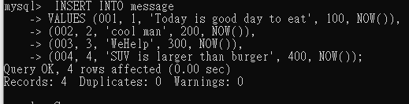</br>
```確認message 資料表```</br>
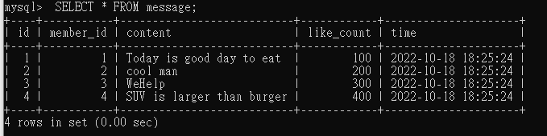
```結果```</br>
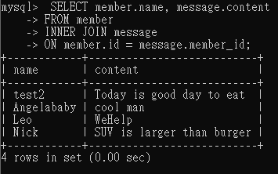

+ <div style="font-size:0.7em">使⽤ SELECT 搭配 JOIN 語法，取得 member 資料表中欄位username 是 test 的所有留⾔，資料中須包含留⾔者會員的姓名。</div>
```增加 member 會員資料```</br>
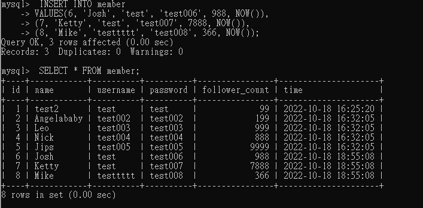</br>
```結果```</br>
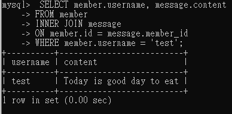

+ <div style="font-size:0.7em">使⽤ SELECT、SQL Aggregate Functions 搭配 JOIN 語法，取得 member 資料表中欄位 username 是 test 的所有留⾔平均按讚數。</div>
``` message 表中只有一位 username 是 test 的人留言```</br>
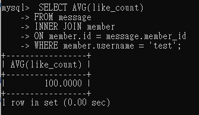</br>
``` 增加 message 表中對應 member 表中username 是 test 的人數```</br>
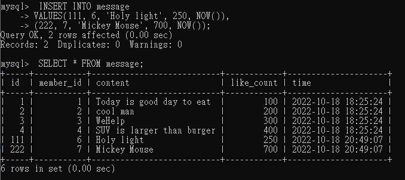</br>
``` 新增過後的平均試算```</br>
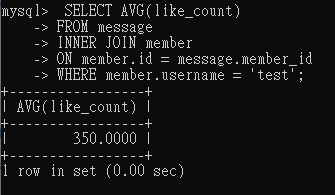</br>

###### 額外練習
```紀錄按讚數量，記錄每一個留言的按讚會員```
+ <div style="font-size:0.7em">先建立一張中介表，me_id 及 m_id 分別對應 message及member 表中的 id<span style="background-color:#ebfaeb">(intermediate table)</span></div>
```中介表```
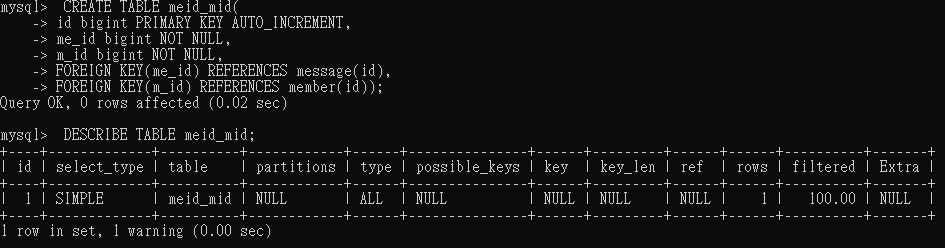
```根據留言編號取得那些會員按過讚```
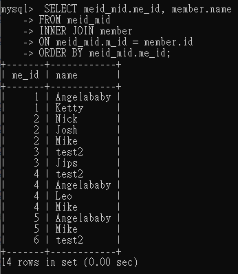
+ <div style="font-size:0.7em">會員若是嘗試對留言按讚：要先檢查該會員id是否按過讚，未按過才+1讚並記錄按讚會員</div>
```加入me_id=1 及 m_id=2 這組資料前的中介表```
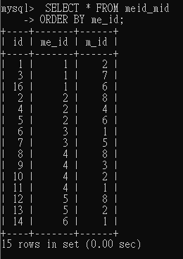
```增加已經對留言1按過讚的會員2，中介表無增加該資料```
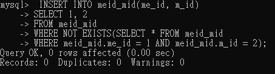
```計算各留言總計有多少讚```
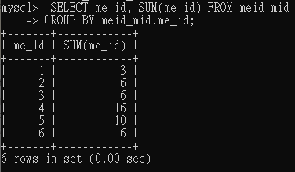
```增加尚未對留言1按過讚的會員3，加入成功```
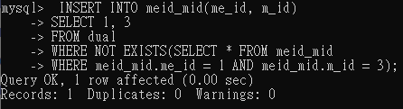
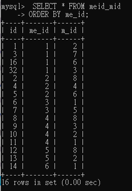
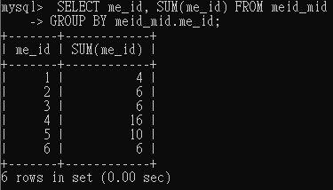