## WeHelp week5 hw readme
###### 要求二：建立資料庫和資料表
```語法```
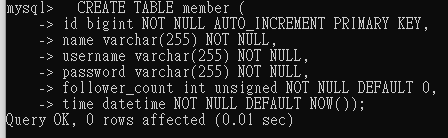
```表實際情況```
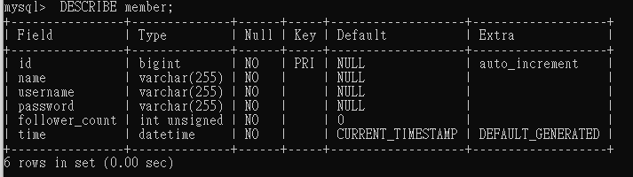
###### 要求三：SQL CRUD
+ <div style="font-size:0.7em">使⽤ INSERT 指令新增⼀筆資料到 member 資料表中，這筆資料的 username 和password 欄位必須是 test。接著繼續新增⾄少 4 筆隨意的資料。</div>
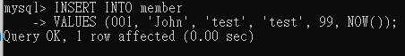
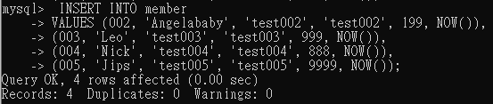


+ <div style="font-size:0.7em">使⽤ SELECT 指令取得所有在 member 資料表中的會員資料。</div>
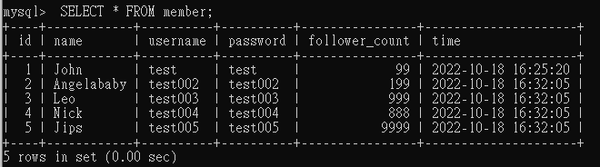

+ <div style="font-size:0.7em">使⽤ SELECT 指令取得所有在 member 資料表中的會員資料，並按照 time 欄位，由
近到遠排序。</div>
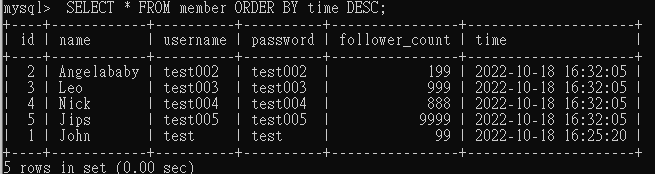

+ <div style="font-size:0.7em">使⽤ SELECT 指令取得 member 資料表中第 2 ~ 4 共三筆資料，並按照 time 欄位，由近到遠排序。<span style="color:red;">( 並非編號 2、3、4 的資料，⽽是排序後的第 2 ~ 4 筆資料 )</span></div>


+ <div style="font-size:0.7em">使⽤ SELECT 指令取得欄位 username 是 test 的會員資料。</div>
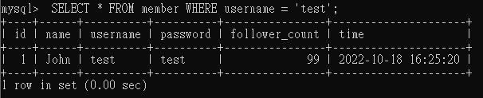

+ <div style="font-size:0.7em">使⽤ SELECT 指令取得欄位 username 是 test、且欄位 password 也是 test 的資料。</div>
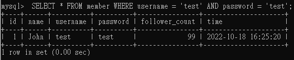

+ <div style="font-size:0.7em">使⽤ UPDATE 指令更新欄位 username 是 test 的會員資料，將資料中的 name 欄位改成test2。</div>
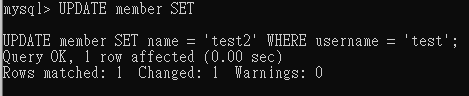
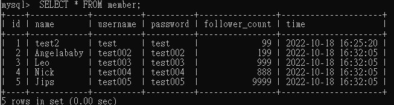

###### 要求四：SQL Aggregate Functions
+ <div style="font-size:0.7em">取得 member 資料表中，總共有幾筆資料 ( 幾位會員 )。</div>
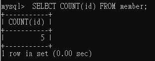

+ <div style="font-size:0.7em">取得 member 資料表中，所有會員 follower_count 欄位的總和。</div>
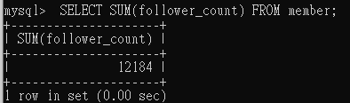

+ <div style="font-size:0.7em">取得 member 資料表中，所有會員 follower_count 欄位的平均數。</div>
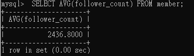

###### 要求五：SQL JOIN (Optional)

+ <div style="font-size:0.7em">建立新資料表紀錄留⾔資訊，取名字為 message。</div>
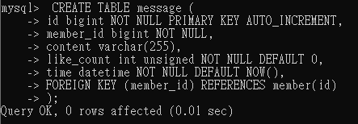
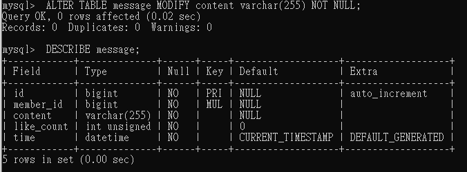